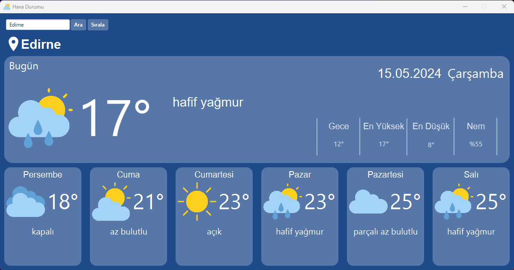

# ☀️ Günlük Hava Durumu Uygulaması (JavaFX)

Bu proje, JavaFX kullanılarak geliştirilen bir masaüstü hava durumu uygulamasıdır.
Bu proje Marmara Üniversitesi Veri Yapıları ve Algoritmalar dersi projesi olarak geliştirilmiştir.
Kullanıcı, güncel hava durumu verilerini görsel bir arayüz üzerinden görüntüleyebilir.  
Veri yapıları olarak **Linked List** ve **Stack** gibi yapılardan kullanılmıştır.

---

## 🚀 Özellikler

- 🌤 OpenWeatherMap API üzerinden anlık veri çekme
- 🧠 Veri yapıları: Linked List ve Stack
- 🧠 Kullanılan Algoritmalar: Bubble Sort Algoritması, Linear Search
- 🎨 JavaFX + Scene Builder kullanılarak görsel arayüz
- 📅 Haftalık hava durumu görünümü
- 💾 Temiz mimari: API, Controller, Model sınıfları ayrımı

---

## 🧰 Kullanılan Teknolojiler

- **Java 17**
- **JavaFX**
- **Scene Builder**
- **OpenWeatherMap API**

---

## 🖼️ Ekran Görüntüsü



---

## 🧪 Projeyi Çalıştırmak

### 1. Repoyu klonla:

```bash
git clone https://github.com/halitbgc/WeatherApp.git
cd WeatherApp
```

### 2. JavaFX'i yapılandır

Eğer JavaFX yüklü değilse, SDK indirip IDE'ne (IntelliJ/Eclipse) eklemen gerekir.

### 3. Çalıştır:

Maven kullanıyorsan:

```bash
mvn javafx:run
```

IDE üzerinden manuel çalıştırma da mümkündür (`HelloApplication.java` → Run).

---

## 🔮 Geliştirme Olanakları

- 🧭 GPS ile konumdan otomatik hava durumu
- 🗓️ Geçmiş hava durumu görüntüleme
- ☁️ Hava tahminlerine grafik desteği

---

## 🤝 Katkı

Katkı sağlamak istersen `fork`, `pull request` ve `issue` açarak destek olabilirsin.

---

## 📜 Lisans

MIT Lisansı © [halitbgc](https://github.com/halitbgc)
